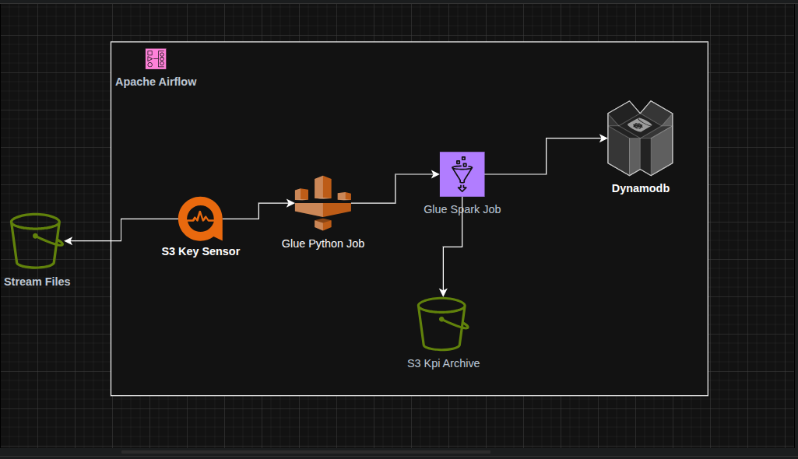

# Music Streaming Real-Time Pipeline Documentation

## Overview
This project implements a real-time music streaming data pipeline using AWS services, designed to process streaming data, validate it, compute KPIs, and store results in DynamoDB and S3. The pipeline is orchestrated using Apache Airflow and leverages AWS Glue for data validation and ETL processing.

## Architecture

The pipeline consists of three main components:
1. **Data Validation**: Ensures incoming CSV files contain required columns.
2. **ETL Processing**: Transforms and computes KPIs from validated data.
3. **Orchestration**: Manages the workflow using Airflow, including file monitoring, validation, ETL, and archiving.

### AWS Services Used
- **S3**: Storage for raw, processed, and archived data.
- **AWS Glue**: Executes Python Shell and PySpark jobs for validation and ETL.
- **DynamoDB**: Stores KPIs and tracks processed files.
- **CloudWatch**: Logs metrics for monitoring.
- **Airflow**: Orchestrates the pipeline.

## Components

### Technology Stack
- **Orchestration**: Apache Airflow (MWAA)
- **Data Processing**: AWS Glue (PySpark + Python Shell)
- **Storage**: Amazon S3, DynamoDB
- **Monitoring**: CloudWatch
- **Infrastructure**: AWS

### Data Flow
1. **Data Ingestion**: CSV files arrive in S3 buckets
2. **Detection**: S3KeySensor detects new files
3. **Validation**: Python Shell job validates data quality
4. **Processing**: PySpark job transforms and computes KPIs
5. **Storage**: Results stored in DynamoDB and S3 Parquet
6. **Archival**: Processed files moved to archive

---

## Components

### 1. Airflow DAG (`music_streaming_realtime_pipeline`)

**Purpose**: Orchestrates the entire pipeline workflow

**Key Tasks**:
- `wait_for_streams_files`: S3KeySensor for file detection
- `validate_data_quality`: Data validation using Python Shell
- `check_validation_status`: Conditional branching based on validation
- `realtime_etl_processing`: Main ETL processing with PySpark
- `write_kpis_to_dynamodb`: Dedicated DynamoDB writing
- `archive_processed_files`: File archival and cleanup

**Schedule**: Event-driven (triggered by file arrivals)

### 2. Validation Job (`music_streaming_validation`)

**Purpose**: Validates data quality before processing

**Technology**: AWS Glue Python Shell

**Validation Checks**:
- **Schema Validation**: Required columns present
  - Streams: `user_id`, `track_id`, `listen_time`
  - Songs: `track_id`, `track_genre`, `track_name`, `artists`
  - Users: `user_id`, `user_name`, `user_age`, `user_country`
- **File Existence**: All required files accessible
- **Basic Quality**: File readability and structure

**Output**: Validation report saved to S3

### 3. ETL Job (`music_streaming_etl_complete`)

**Purpose**: Processes validated data and computes KPIs

**Technology**: AWS Glue PySpark

**Processing Steps**:
1. **File Tracking**: Identifies unprocessed files
2. **Data Loading**: Reads CSV files from S3
3. **Transformation**: Standardizes column names and formats
4. **Joining**: Combines streams, songs, and users data
5. **KPI Computation**: Calculates daily metrics
6. **Storage**: Writes to DynamoDB and S3 Parquet

### 4. Data Storage

**DynamoDB Tables**:
- `kpi.table`: Main KPI storage
- `kpi.table_file_tracker`: File processing tracking

**S3 Buckets**:
- `rds.data`: Raw CSV files
- `trial.data`: Processed Parquet files and validation reports
- `warehouse.bucket`: Quarantine for problematic data

---

## Setup Instructions

### Prerequisites
- AWS Account with appropriate permissions
- MWAA environment configured
- S3 buckets created
- IAM roles and policies configured

## Setup Instructions

### Configure AWS Connection in Airflow
1. Go to Airflow UI > Admin > Connections
2. Create new connection:
   - **Connection Id**: `aws_default`
   - **Connection Type**: `Amazon Web Services`
   - **AWS Access Key ID**: Your access key
   - **AWS Secret Access Key**: Your secret key
   - **Extra**: `{"region_name": "us-east-1"}`

---

## Pipeline Workflow

### Detailed Workflow Steps

#### Phase 1: Data Arrival Detection
1. **File Upload**: CSV files uploaded to `s3://rds.data/streams/`
2. **S3KeySensor**: Polls every 60 seconds for `*.csv` files
3. **Trigger**: When files detected, pipeline starts

#### Phase 2: Data Validation
1. **Schema Check**: Validates required columns exist
2. **Quality Check**: Basic data integrity validation
3. **Report Generation**: Saves validation results to S3
4. **Decision**: Pass/fail determines pipeline continuation

#### Phase 3: ETL Processing (If Validation Passes)
1. **File Tracking**: Checks DynamoDB for unprocessed files
2. **Data Loading**: Reads CSV files from S3
3. **Transformation**: 
   - Rename `listen_time` → `timestamp`
   - Rename `track_genre` → `genre`
   - Add default `listen_duration` (180 seconds)
4. **Joining**: Streams ⟷ Songs ⟷ Users
5. **KPI Computation**: Calculate daily metrics
6. **File Marking**: Update processing status in DynamoDB

#### Phase 4: Data Storage
1. **DynamoDB Writing**: Store KPIs with optimized partition keys
2. **Parquet Archive**: Save processed data to S3
3. **File Archival**: Move processed files to archive folder

### Error Handling
- **Validation Failure**: Pipeline stops, detailed error logging
- **ETL Failure**: Failed files marked for retry, other files continue
- **DynamoDB Failure**: Retry with exponential backoff

---
